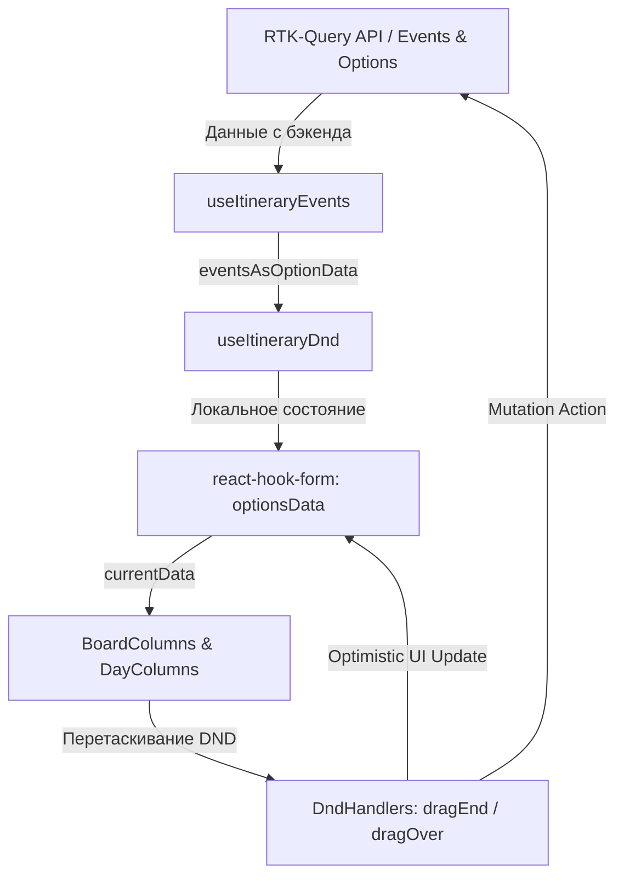

# Логика работы виджета **Itinerary**

Документ описывает архитектуру, потоки данных, способы рендеринга и критические ошибки в логике работы виджета маршрута (`Itinerary`).

---

## 1. Общий поток данных и синхронизация



1. **`useItineraryOptions(tourId)`**:
   - Запрашивает опции (варианты маршрута) с бэкенда через `useListAllTourOptionsQuery`.
   - Управляет переключением (`activeOption`) и созданием/удалением опций.
2. **`useItineraryEvents(tourId, activeOption)`**:
   - Запрашивает список событий для активной опции через `useListTourEventsQuery`.
   - Преобразует плоский список событий с бэкенда в структурированные данные `IOptionData` (разделение на `days` и `tripDetails`).
3. **`useItineraryDnd`**:
   - Связывает `react-hook-form` (для мгновенного/оптимистичного обновления UI) и бэкенд-мутации.
   - Синхронизирует данные из хука событий в форму через `useEffect` при смене `activeOption` или обновлении кэша RTK-Query.

---

## 2. Логика добавления ивента (Event Creation)

1. **Drag-Start**: Перетаскивание элемента из боковой панели шаблонов (`template:flight`, `template:accommodation` и т.д.).
2. **Drag-End**:
   - `handleDragEnd` определяет тип перетаскиваемого объекта.
   - Метод `createItemFromTemplate` генерирует временный объект `IDayItem` с временным UUID в качестве `id` и уникальным `block_id`.
   - Данные добавляются в локальное состояние формы (`optionsData`) с помощью `addItemToData` (Optimistic UI).
   - Возвращается экшн `{ type: 'create', day, position, ... }`.
3. **Запрос к API**:
   - Вызывается мутация `createEvent` с параметрами события.
   - Запрос оборачивается в `toast.promise`.
   - **При успехе**: Возвращенный с бэкенда реальный ID события сохраняется в карточку (поле `backendId`).
   - **При ошибке**: Происходит откат формы к `prevOptionsData`.

---

## 3. Логика добавления Option (Option Creation)

1. Клик по кнопке добавления опции вызывает метод `handleAddOption` в `useItineraryOptions`.
2. Запускается мутация `createTourOption`.
3. В `option.service.ts` реализован механизм оптимистичного обновления кэша через `onQueryStarted`:
   ```typescript
   async onQueryStarted({ tourId }, { dispatch, queryFulfilled }) {
       const { data: newOption } = await queryFulfilled;
       dispatch(
           tourOptionApi.util.updateQueryData("listAllTourOptions", tourId, (draft) => {
               draft.push(newOption);
           })
       );
   }
   ```
   Новая опция пушится в кэш RTK-Query, провоцируя автоматический реактивный ререндер табов в `BoardTabs`.

---

## 4. Как берется количество колонок (Days)

Количество колонок на доске определяется динамически на основе событий, полученных с бэкенда:
1. В хуке `useItineraryEvents` собираются все уникальные дни из событий:
   ```typescript
   const allDays = new Set<number>();
   for (const ev of backendEvents) {
       allDays.add(ev.day);
   }
   ```
2. Массив `dayOrder` сортируется по возрастанию:
   ```typescript
   const dayOrder = Array.from(allDays).sort((a, b) => a - b);
   ```
3. Компонент `BoardColumns` обходит `dayOrder` и рендерит `<SortableDayColumn>` для каждого дня.
4. **Резервный сценарий**: Если список событий пуст (`allDays.size === 0`), возвращается `EMPTY_OPTION_DATA`, содержащий ровно один день: `dayOrder: [1]`, `days: { 1: [] }`.

---

## 5. Выявленные ошибки логики и проблемные места

### 1. Ошибка обновления ID при создании ивента (Сломанные ссылки и DND во вложенных структурах)
* **Где**: `useItineraryDnd.ts` (колбэк `success` при создании события).
* **Суть**:
  - Бэкенд возвращает созданный объект с реальным `newEvent.id`.
  - Код пытается обновить `backendId` только у элементов первого уровня в `optData.days[action.day]`.
  - **Баг A**: Если событие добавлено во вложенный контейнер (`items` внутри `MULTIPLY_OPTION`) или в `tripDetails`, его `backendId` **никогда не обновится**. При попытке его переместить/удалить бэкенд вернет ошибку.
  - **Баг B**: Обновляется только `backendId`, а `item.id` остается временным `uuidv4()`. Ссылки на карточках ведут на `buildRoute(..., { eventId: item.id })`. Это приведет к ошибке 404 при попытке открыть только что созданную карточку до полной перезагрузки страницы.

### 2. Отсутствие синхронизации при действиях с Trip Details
* **Где**: `drag-end-handler.ts`.
* **Суть**:
  - `action` для мутации `move` или `reorder` формируется только в ветке `else if (targetContainer.location === "day")`.
  - При перемещении элемента в контейнер `tripDetails` (или внутри него) `action` возвращается как `undefined`.
  - **Результат**: Визуально элемент перемещается в UI (в локальном стейте формы), но запрос на бэкенд не отправляется. После перезагрузки страницы перемещение сбрасывается.

### 3. Ошибка удаления вложенных ивентов
* **Где**: `useItineraryDnd.ts` -> `handleRemoveItem`.
* **Суть**:
  - При удалении элемента хук пытается найти удаляемый объект по индексу: `optData.days[loc.day]?.[loc.index]`.
  - Если удаляется вложенный элемент (`nestedIndex !== undefined`), этот код вернет родительский элемент (группу `MULTIPLY_OPTION`), и бэкенду будет отправлен запрос на удаление **всей группы** вместо конкретного вложенного события.

### 4. Некорректная обработка `day === 0` (Trip Details)
* **Где**: `use-itinerary-events.ts`.
* **Суть**:
  - События с `day === 0` (относящиеся к Trip Details) добавляются в общий цикл, из-за чего `0` попадает в `allDays` и в `dayOrder`. На доске рендерится колонка "День 0".
  - Контейнер `tripDetails` в возвращаемом объекте всегда остается пустым (`tripDetails: []`).
  - При отсутствии дневных событий (`allDays.size === 0`) код возвращает `EMPTY_OPTION_DATA`, полностью стирая `tripDetails`, даже если они были загружены.

### 5. Инвалидация кэша при реордере (`reorderEvent`)
* **Где**: `event.service.ts` -> `reorderEvent`.
* **Суть**:
  - В отличие от `createEvent` и `updateTourEvent`, мутация `reorderEvent` не имеет обработчика `onQueryStarted` для ручного обновления кэша `listTourEvents`.
  - **Результат**: После успешного реордера на бэкенде, кэш RTK-Query хранит старый порядок элементов. Любое действие, провоцирующее ререндер или чтение кэша, вернет старый порядок и сбросит UI.

### 6. Нарушение спецификации HTML и баги кликов (Nested Links)
* **Где**: `draggable-day-item.tsx`.
* **Суть**:
  - Карточка `Card` целиком обернута в `<Link to={href}>`.
  - Внутри карточки находятся другие интерактивные элементы: ручка DND (кнопка `Button`), dropdown-меню удаления (`DraggableDayItemMenu`) и потенциально вложенные карточки (через `DroppableNestedContainer`).
  - **Баг**: Клик на ручку DND или кнопку меню всплывает (event bubbling) до родительского `<Link>` и вызывает переход на страницу деталей события.
  - HTML-валидация запрещает вкладывать тег `<a>` (`Link`) внутрь другого тега `<a>` или размещать интерактивные кнопки внутри ссылок.
