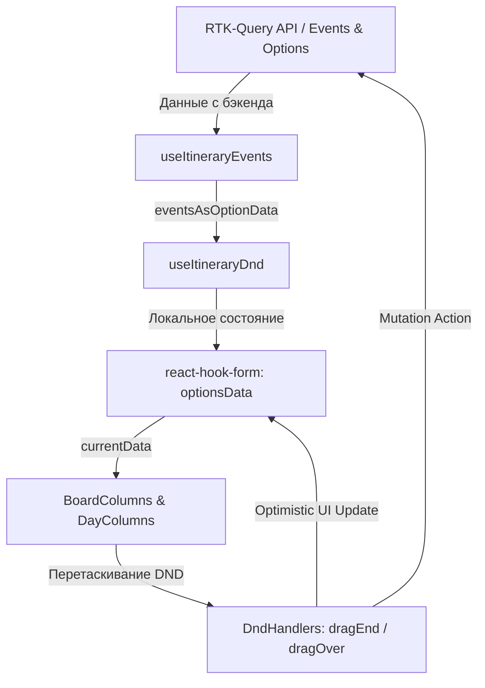

# Логика работы виджета **Itinerary**

Документ описывает архитектуру, потоки данных, способы рендеринга и критические ошибки в логике работы виджета маршрута (`Itinerary`).

---

## 1. Общий поток данных и синхронизация


```mermaid
graph TD
    API[RTK-Query API / Events & Options] -->|Данные с бэкенда| HookEvents[useItineraryEvents]
    HookEvents -->|eventsAsOptionData| HookDnd[useItineraryDnd]
    HookDnd -->|Локальное состояние| Form[react-hook-form: optionsData]
    Form -->|currentData| UI[BoardColumns & DayColumns]
    UI -->|Перетаскивание DND| DndHandlers[DndHandlers: dragEnd / dragOver]
    DndHandlers -->|Optimistic UI Update| Form
    DndHandlers -->|Mutation Action| API
```

1. **`useItineraryOptions(tourId)`**:
   - Запрашивает опции (варианты маршрута) с бэкенда через `useListAllTourOptionsQuery`.
   - Управляет переключением (`activeOption`) и созданием/удалением опций.
2. **`useItineraryEvents(tourId, activeOption)`**:
   - Запрашивает список событий для активной опции через `useListTourEventsQuery`.
   - Преобразует плоский список событий с бэкенда в структурированные данные `IOptionData` (разделение на `days` и `tripDetails`).
3. **`useItineraryDnd`**:
   - Связывает `react-hook-form` (для мгновенного/оптимистичного обновления UI) и бэкенд-мутации.
   - Синхронизирует данные из хука событий в форму через `useEffect` при смене `activeOption` или обновлении кэша RTK-Query.

---

## 2. Логика добавления ивента (Event Creation)

1. **Drag-Start**: Перетаскивание элемента из боковой панели шаблонов (`template:flight`, `template:accommodation` и т.д.).
2. **Drag-End**:
   - `handleDragEnd` определяет тип перетаскиваемого объекта.
   - Метод `createItemFromTemplate` генерирует временный объект `IDayItem` с временным UUID в качестве `id` и уникальным `block_id`.
   - Данные добавляются в локальное состояние формы (`optionsData`) с помощью `addItemToData` (Optimistic UI).
   - Возвращается экшн `{ type: 'create', day, position, ... }`.
3. **Запрос к API**:
   - Вызывается мутация `createEvent` с параметрами события.
   - Запрос оборачивается в `toast.promise`.
   - **При успехе**: Возвращенный с бэкенда реальный ID события сохраняется в карточку (поле `backendId`).
   - **При ошибке**: Происходит откат формы к `prevOptionsData`.

---

## 3. Логика Option (create / edit / delete)

1. **Create**: `CreateOption` (`@/features/tours`) у кнопки `+` в `BoardTabs`. Submit: `createTourOption` → при выборе файла `uploadOptionCover` (как landing).
2. **Edit**: `EditOption` в меню таба (`DropdownMenuItem asChild` + `trigger`). Submit: `updateTourOption` → cover upload/delete.
3. **Delete**: `DeleteOption` в меню таба, confirm dialog. `deleteOption` + `onDeleted` для смены `activeOption`.
4. `useItineraryOptions` — только `listAllTourOptions` и UI-state (`activeOption`, `createOpen`). При пустом списке открывается create-модалка.
5. Список табов обновляется через `invalidatesTags` RTK Query после мутаций.

---

## 4. Как берется количество колонок (Days)

Количество колонок на доске определяется динамически на основе событий, полученных с бэкенда:
1. В хуке `useItineraryEvents` собираются все уникальные дни из событий:
   ```typescript
   const allDays = new Set<number>();
   for (const ev of backendEvents) {
       allDays.add(ev.day);
   }
   ```
2. Массив `dayOrder` сортируется по возрастанию:
   ```typescript
   const dayOrder = Array.from(allDays).sort((a, b) => a - b);
   ```
3. Компонент `BoardColumns` обходит `dayOrder` и рендерит `<SortableDayColumn>` для каждого дня.
4. **Резервный сценарий**: Если список событий пуст (`allDays.size === 0`), возвращается `EMPTY_OPTION_DATA`, содержащий ровно один день: `dayOrder: [1]`, `days: { 1: [] }`.

---

## 5. Multi-option API (фактический контракт)

- Parent: `event.typ === "10"` (`ENUM_EVENT.MULTIPLY_OPTION`), слот = `day` + `position`.
- Children: `event.details[]` с собственным `id` (= `eventOptionId`).
- Single update: `PATCH .../event/single/{eventId}/update` (`updateTourEvent` RTK → `updateSingleEvent` path).
- Nested CRUD: `addEventOption` / `updateEventOption` / `deleteEventOption` / `reorderEventOptions` / `moveEventToMulti` / `moveEventOptionToSingle`.
- Hydration: `useItineraryEvents` → `IDayItem.items` из `ITourEvent.options`.
- DND: `TDragAction` ветвит root vs nested (`addOption`, `reorderOptions`, `moveToMulti`, `moveToSingle`).

## 6. Выявленные ошибки логики и проблемные места

### Исправлено (multi API)

1. **`patchBackendId`** — ищет temp card в `days`, `tripDetails` и nested `items`; обновляет и `backendId`, и `id`.
2. **Удаление nested** — `deleteEventOption(parentId, eventOptionId)`, не `deleteTourEvent` родителя.
3. **`reorderEvent` / multi-мутации** — `invalidatesTags` на `TOURS_EVENTS` (кэш списка обновляется после reorder).

### Остаётся

### 1. Отсутствие синхронизации при действиях с Trip Details
* **Где**: `drag-end-handler.ts`.
* **Суть**:
  - Root move/reorder action для `tripDetails` по-прежнему не всегда формируется (ветка только для `location === "day"`).
  - **Результат**: визуальный move в tripDetails может не уйти на бэкенд.

### 2. Некорректная обработка `day === 0` (Trip Details) — частично
* **Где**: `use-itinerary-events.ts`.
* **Суть**: `day === 0` теперь кладётся в `tripDetails`, но краевые кейсы с пустым списком дневных событий стоит перепроверить вручную.

### 3. Нарушение спецификации HTML и баги кликов (Nested Links)
* **Где**: `draggable-day-item.tsx`.
* **Суть**:
  - Карточка `Card` целиком обернута в `<Link to={href}>`.
  - Внутри карточки находятся другие интерактивные элементы: ручка DND (кнопка `Button`), dropdown-меню удаления (`DraggableDayItemMenu`) и потенциально вложенные карточки (через `DroppableNestedContainer`).
  - **Баг**: Клик на ручку DND или кнопку меню всплывает (event bubbling) до родительского `<Link>` и вызывает переход на страницу деталей события.
  - HTML-валидация запрещает вкладывать тег `<a>` (`Link`) внутрь другого тега `<a>` или размещать интерактивные кнопки внутри ссылок.
